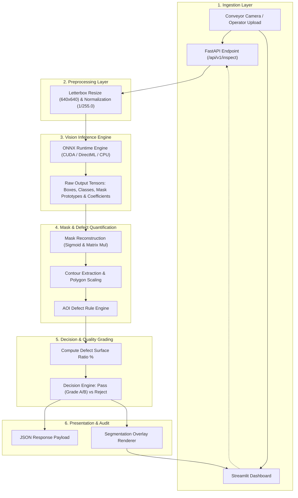

# System Architecture

## 1. High-Level Architecture Diagram

---

## 2. Core Subsystems & Components

### 2.1 Preprocessing Pipeline
* Standardizes all input images to model input dimensions ($640 \times 640$).
* Preserves aspect ratio using letterboxing with grey padding (`(114, 114, 114)`).
* Normalizes pixel values: $X_{\text{norm}} = \frac{X}{255.0}$ with RGB channel order.

### 2.2 Inference Engine (`src/core/detector.py`)
* Abstract base class `BaseDetector` supporting two implementations:
  1. `PyTorchDetector`: Uses Ultralytics YOLOv8-seg (for development & training).
  2. `ONNXDetector`: Optimized execution via `onnxruntime.InferenceSession`.
* Extracts:
  * Bounding boxes $(x_1, y_1, x_2, y_2)$
  * Class ID & Confidence score
  * Mask coefficients multiplied against prototype masks to generate boolean pixel maps.

### 2.3 AOI Rule Engine (`src/core/grader.py`)
* Calculates spatial overlap between fruit body mask and defect masks.
* Formulas:
  $$\text{Defect Ratio} = \frac{\text{Defect Pixel Count}}{\text{Fruit Pixel Count}} \times 100$$
* Grade mapping:
  * `GRADE_A`: $\text{Defect Ratio} \le 1.0\%$ AND `rot == 0`
  * `GRADE_B`: $1.0\% < \text{Defect Ratio} \le 5.0\%$ AND `rot == 0`
  * `REJECT`: $\text{Defect Ratio} > 5.0\%$ OR `rot > 0`

### 2.4 API Service (`src/api/main.py`)
* Asynchronous REST API powered by FastAPI.
* Endpoints:
  * `POST /api/v1/inspect`: Accepts multipart image file, returns JSON inspection report and optional base64 overlay.
  * `GET /api/v1/health`: Returns model availability and runtime version.
  * Per-inspection latency is returned in the `timing` response object.

### 2.5 Operator Dashboard (`src/ui/dashboard.py`)
* Built with Streamlit for clean factory-floor simulation.
* Side-by-side display: Raw Camera Feed vs. AI Segmented Overlay with bounding boxes and defect contours.
* KPI cards: Current Grade, Defect %, Inference Latency (ms), and Confidence.

---

## 3. Technology Stack & Decision Rationale

| Layer | Selected Tech | Rationale | ViTrox Relevance |
| :--- | :--- | :--- | :--- |
| **Model** | YOLOv8-seg | Simultaneous bounding box + pixel mask at high FPS | Core AOI requirement |
| **Runtime** | ONNX Runtime | $2\text{--}4\times$ inference speedup; hardware agnostic | Edge machine deployment |
| **Backend** | FastAPI | High-throughput async I/O, auto OpenAPI docs | Microservice vision server |
| **UI** | Streamlit | Rapid industrial dashboard prototyping | Operator terminal |
| **Container** | Docker | Consistent packaging across dev and factory PC | Industrial IPC deployment |
